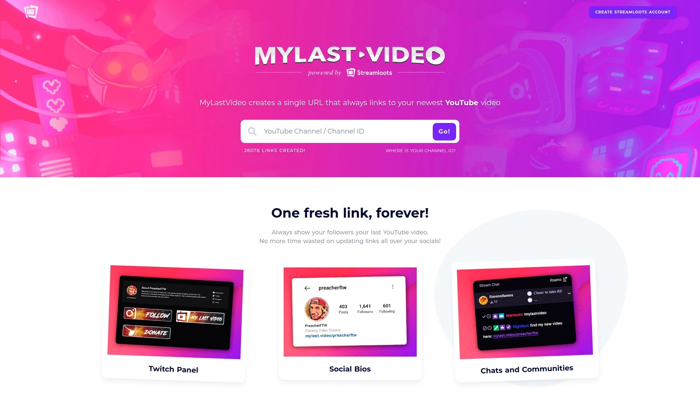

# Top 25 Best YouTube Channel Growth Tools in 2025

Growing a YouTube channel takes more than just uploading videos. Creators need reliable tools to analyze performance, optimize content for search, and understand what resonates with their audience. Whether you're tracking subscriber trends, researching high-performing keywords, or scheduling content across multiple platforms, the right software can transform how quickly your channel scales. This guide walks through proven platforms that help creators boost visibility, increase watch time, and build loyal communities around their content.

## **[vidIQ](https://vidiq.com)**

All-in-one YouTube growth platform that helps creators optimize content, discover trending topics, and reach larger audiences through data-driven insights.

vidIQ stands out as a comprehensive solution for YouTube creators at any stage. The platform offers daily topic suggestions uniquely tailored to your channel, emerging trend analysis, and proven viral video blueprints that serve as inspiration for your next success. The Create tab generates compelling titles, captivating thumbnails, and complete video outlines from a single idea, letting you focus on production rather than planning.

The Optimize tab provides personalized feedback on existing videos with actionable suggestions for improving titles and thumbnails. Keywords and SEO tabs ensure your content achieves better visibility in YouTube search results. For creators seeking deeper expertise, vidIQ offers one-on-one coaching programs with YouTube experts who address specific concerns and guide you through growth challenges.

The Chrome extension integrates directly into YouTube Studio, displaying real-time statistics and progress toward monetization goals. Keyword research capabilities help identify high-potential search terms with accurate volume data, while the SEO studio analyzes titles, descriptions, tags, and transcripts to maximize optimization.

## **[TubeBuddy](https://www.tubebuddy.com)**

Browser-based YouTube optimization tool offering 50+ features for keyword research, A/B testing, bulk editing, and channel management productivity.

TubeBuddy empowers creators with comprehensive tools designed for YouTube optimization and driving channel growth to the next stage. Active users experience 79% more views and 32% more subscribers compared to non-active users, with the platform trusted by over 15 million creators worldwide.

The keyword explorer provides accurate search volume data to identify high-potential keywords worth targeting. Search rank tracking monitors how your videos perform for specific terms over time, while A/B testing capabilities let you deploy experiments on titles, thumbnails, descriptions, and tags to optimize based on real performance data.

Bulk processing tools allow simultaneous edits across multiple videos, saving hours of manual work. Card templates for calls-to-action and scheduled end screens streamline production workflows. The retention analyzer pinpoints exactly where viewers drop off in your videos, making it easy to identify less engaging sections and improve future content.

## **[Social Blade](https://socialblade.com)**

Free statistics tracking platform displaying YouTube subscriber counts, view ranks, daily growth metrics, and estimated revenue for any channel.

Social Blade provides an intuitive layout that makes YouTube statistics easier to read than native analytics for many creators. The platform assigns letter grades to channels and displays subscriber and video view ranks alongside a proprietary Social Blade rank. Glancing at the 30-day view and subscriber changes with percentage indicators quickly reveals whether your channel is growing, often more conveniently than YouTube Creator Studio.

Daily breakdowns show views, subscribers, and estimated earnings per day rather than monthly aggregates, with growth displayed in green and losses in red. This chart reveals which videos benefited your channel most after posting based on upload dates, providing clear insights into what your audience wants to see.

The platform excels at competitive analysis, allowing you to monitor direct competitors of similar size within your genre. By examining their daily performance data, you can identify which of their videos perform best and use those insights to design your content strategy.

## **[Hootsuite](https://www.hootsuite.com/youtube)**

Enterprise social media management platform with YouTube scheduling, analytics, comment moderation, and AI-powered content writing capabilities.

Hootsuite serves as a centralized hub for YouTube alongside all other social networks, letting you schedule videos to go live with content across platforms from a single dashboard. The ViralPost feature calculates optimal posting times to capture more views and engagement even when you're offline.

Detailed YouTube video analytics monitor subscriber growth, engagement rates, views, and average view duration. The platform shows exactly when to post based on your audience's habits and unique goals, helping you optimize timing for maximum impact.

YouTube comment moderation through Hootsuite Streams lets you approve, delete, or reply to comments while identifying spam in seconds. Streams also monitors keywords across YouTube so you stay informed about emerging trends. OwlyWriter AI generates YouTube descriptions and titles quickly while helping you develop post ideas for every platform on any topic.

## **[Morningfame](https://morningfa.me)**

Guided video optimization platform focused on YouTube search ranking through keyword research, channel comparisons, and specific growth recommendations.

Morningfame guides creators through the process of optimizing videos for YouTube search, the most dependable way to reach new viewers whose views expand your reach and grow your channel. The guided optimization process applies best practices from YouTube experts and has proven effective for channels of all sizes.

The platform compares your channel with others of similar size, putting statistics into perspective so weak spots become visible. Specific recommendations direct your attention to areas where time is well spent improving, with suggestions on how to enhance performance.

At a glance, Morningfame shows which videos worked and which didn't, allowing you to easily spot and repeat what makes your videos successful. This helps you try new approaches instead of repeating what made some videos flop. The Strategy tab measures signals YouTube looks for to identify if audiences like videos, including views, watch time, and engagement.

## **[Canva](https://www.canva.com)**

Web-based design platform for creating YouTube thumbnails, channel art, and visual content with templates, graphics, and AI-powered tools.

Canva provides an extremely simple interface for creating professional YouTube thumbnails without design experience. The platform offers numerous templates specifically sized for YouTube thumbnails, giving creators inspiration and starting points for their designs. Free and paid graphic elements let you build eye-catching thumbnails that increase click-through rates.

The AI thumbnail maker accelerates creation by generating design options based on your content description. Thousands of customizable YouTube thumbnail templates cater to different niches, from gaming and tech to lifestyle and education. Drag-and-drop functionality makes the design process intuitive even for beginners.

Beyond thumbnails, Canva supports creating channel banners, end screens, social media graphics for promoting videos, and presentation materials. The web-based nature means you can access your designs from any device without software installation.

## **[Ahrefs Keywords Explorer](https://ahrefs.com/youtube-keyword-tool)**

YouTube keyword research database with 640+ million keywords showing search volume, clicks, competition data, and trend analysis.

Keywords Explorer runs on a massive database covering over 640 million YouTube keywords powered by clickstream data. You can search almost any keyword and see metrics including local and global search volume for nearly every country, clicks, and click percentage. This reveals how many people search for a query monthly and how many of those searches result in clicks on search results.

Analyzing clicks and volume together provides more insight than volume alone. The platform lets you check SEO metrics for up to 10,000 keywords simultaneously by pasting them in or uploading a file. Five keyword ideas reports include phrase match, having same terms, newly discovered, questions, and all keyword ideas combined.

Filters across all reports help narrow down hundreds or thousands of ideas quickly and easily. Trend graphs show whether keywords are declining or seasonal, helping you avoid targeting topics losing popularity over time. This prevents wasting effort on outdated subjects like older phone models that no longer generate significant search interest.

## **[Sprout Social](https://sproutsocial.com)**

Enterprise social media management platform offering unified YouTube publishing, analytics, listening, and team collaboration tools.

Sprout Social integrates YouTube management with all other social platforms, providing a unified inbox for handling YouTube comments alongside messages from other networks. Cross-platform scheduling coordinates YouTube content with other social media from a single calendar, while comprehensive analytics integrate YouTube performance data with complete social media reporting.

Asset organization stores and organizes YouTube thumbnails, video assets, and branded materials in one location. Team collaboration features let you assign YouTube-related tasks and manage approvals within your existing social workflow, eliminating silos between YouTube and other social efforts.

YouTube Listening uncovers business-critical insights about your audience, industry, and competitors by analyzing videos at scale. Track and analyze videos and hashtags around relevant industry and competitor trends, spotlight vital audience demographics and preferences, and identify influencers and industry thought leaders to cultivate brand advocates.

## **[Buffer](https://buffer.com/youtube)**

Social media scheduling platform supporting YouTube Shorts publishing, cross-platform content distribution, and optimal timing recommendations.

Buffer currently supports scheduling YouTube Shorts in formats including mov, mp4, mpg, mpeg, avi, and WebM with files up to 10GB filmed in 1:1 or 9:16 aspect ratios. The platform helps creators plan, preview, collaborate, and publish content that drives meaningful engagement and growth.

Reporting provides data on views, likes, and comments for each YouTube Short published. The platform manages multiple YouTube channels from one account, with powerful scheduling features that reach audiences no matter their timezone. Queue posts on preset schedules or create custom times to publish when viewers are most active.

Upload once and share to Instagram, TikTok, Facebook, Twitter, LinkedIn, Pinterest, and more for unparalleled video reach. Buffer's AI Assistant generates fresh video ideas tailored to your account when you're stuck in creative ruts, handling the heavy lifting of brainstorming so you can focus on production.

## **[Tubular Labs](https://tubularlabs.com)**

Enterprise video analytics and content intelligence platform tracking over 14 billion videos and 40 million creators across major social platforms.

Tubular Labs provides a unified view of passions and behaviors of audiences across YouTube, Instagram, Facebook, Twitch, and more. With the largest social video database, Tubular helps household name brands, leading agencies, and major media properties grow their business by anticipating trending content, new creators, and what's next in culture.

The platform offers comprehensive tools including performance measurement, benchmarking, and competitive analysis to ensure optimized video strategies. Analytics encompass video views and uploads, video duration, average month-over-month growth, and platform-specific data to provide insights for content creators.

Video analytics, content intelligence, and audience measurement solutions cover over 400 million viewers, 3 billion videos, and 8 million creators. Users gain insights into video content performance, audience behavior, and shifting consumer interests to create successful content and scale audiences efficiently.

## **[Rival IQ](https://www.rivaliq.com)**

Competitive social media analytics platform providing YouTube performance benchmarking, engagement tracking, and competitor content analysis.

Rival IQ delivers clear and actionable competitive insights by automatically tracking and comparing your YouTube performance against competitors on key metrics like engagement rates, subscriber growth, and content strategy. Live industry benchmark dashboards provide essential context for your performance, showing how you measure up in real-time.

Detailed post and content analysis helps discover which video topics, formats, and trends drive engagement for you and your competitors. Automated alerts for high-performing content let you act on opportunities instantly without manual tracking.

Full YouTube stats including engagement rates, post times, and views are clearly laid out in one place with powerful data visualizations making exporting and reporting straightforward. Custom post tagging lets you segment YouTube content by theme, product, or campaign with automated tag rules and bulk tagging features for tracking influencer marketing campaigns.

## **[ChannelMeter](https://channelmeter.com)**

Creator management and analytics platform focused on tracking performance metrics, monetized playbacks, and individual creator contributions.

ChannelMeter tracks basic performance metrics including views, audience size, and estimated minutes watched, with a major focus on YouTube creator management and performance tracking. You can view top performers along with breakdowns of what each creator contributes, including monetized playbacks and analytics.

The platform provides detailed insights into audience demographics, engagement metrics, and revenue analysis. Tools for influencer management and campaign tracking help brands and multi-creator organizations understand overall channel performance while providing valuable data on the impact of specific creators and their content.

Free account signup allows searching and tracking creators, channels, or videos from YouTube, Facebook, Instagram, and Twitch. The platform helps strategize creator roadmaps and plan campaigns through comprehensive performance data.

## **[ViralStat](https://www.youtube.com)**

Video performance tracking tool monitoring content across major social networks with competitor analysis and trending video discovery.

ViralStat tracks video performance across major social platforms, allowing you to monitor key performance indicators from a single dashboard. This simplifies campaign measurement by centralizing data from multiple networks in one location.

The tool provides better understanding of your audience by showing what they engage with on other social media platforms beyond YouTube. This helps discover YouTube video ideas and create content that resonates with them. You can see which creators your audience follows and trusts, informing your influencer marketing strategy.

The platform ranks as one of the top YouTube analytics tools with features that help track competitors' video content to find trending videos. Several reports and analyses improve general performance on YouTube.

## **[Facelift Data Studio](https://www.facelift-bbt.com)**

Comprehensive social media monitoring platform delivering in-depth YouTube analytics for businesses identifying channel growth opportunities.

Facelift Data Studio, formerly known as Quintly, excels as the best social media monitoring tool for comprehensive YouTube analytics. The platform suits businesses looking to identify ways to grow their YouTube channels through unique features that show how audiences engage with content.

Advanced analytics help improve marketing strategy by tracking metrics like impressions, audience engagement, and subscriber growth. The platform monitors ROI, helping measure the impact of YouTube marketing efforts with data-driven insights.

Unique features reveal audience engagement patterns and provide actionable intelligence for optimizing content strategies. The comprehensive approach to YouTube analytics makes it valuable for businesses seeking to maximize their video marketing impact.

## **[Unbox Social](https://unboxsocial.com)**

Social media analytics and monitoring tool providing YouTube competition tracking, content performance comparison, and growth opportunity identification.

Unbox Social enhances efficiency for social media managers at brands and agencies by collecting important information and insights from all platforms in one place. The platform allows inviting team members and publishing reports for management and clients.

Competition tracking enables customers to compare content performance with similar businesses in their industry. Examine historical data, compare content performance, and understand key parameters driving competitor social media strategies. Uncover new growth prospects and learn from strategies that didn't succeed through competitor benchmarking.

YouTube analytics comprise examining platform data to gain knowledge about user behavior, engagement, and content effectiveness. Metrics like clicks, impressions, and conversions evaluate marketing strategy effectiveness. The platform provides a comprehensive overview of YouTube performance focusing on individual post-level insights.

## **[Vidooly](https://vidooly.com)**

YouTube analytics platform featuring video tag suggestions, competitor tracking, optimal upload timing, and subscriber behavior analysis.

Vidooly comes with numerous features including video tag suggestions that help optimize content for better discoverability. Competitor tracking capabilities let you monitor what similar channels are doing and identify successful strategies to adapt for your own content.

The platform suggests the best upload times based on when your audience is most active, maximizing initial engagement that signals YouTube's algorithm. Comment management tools help moderate and respond to viewer feedback efficiently, building community around your channel.

Subscriber behavior analysis reveals patterns in how your audience interacts with content, including which videos drive the most subscriptions and what keeps viewers returning. These insights guide content strategy decisions to accelerate channel growth.

## **[Unmetric](https://www.unmetric.com)**

Social media intelligence platform offering YouTube analytics with viewer sentiment analysis, video tag effectiveness, and competitor benchmarking.

Unmetric's analytics extend beyond performance metrics to offer insights into viewer sentiment and the effectiveness of video tags. This helps understand what works for competitors so you can adjust your strategy accordingly.

The platform lets you analyze and benchmark your content against industry standards to optimize your YouTube strategy. Competitive intelligence reveals what's resonating in your niche, providing direction for your own content creation efforts.

By combining sentiment analysis with performance data, Unmetric provides a more complete picture of how audiences respond to content. This qualitative and quantitative approach helps refine messaging and content formats for better results.

## **[MyLast.Video](https://mylast.video)**

URL redirect tool creating a permanent link that always points to your newest YouTube video for bio links and promotional materials.

MyLast.Video creates a unique link for your YouTube channel that automatically redirects to the newest video you've made. Having your YouTube URL in social media bios is one of the main drivers of channel growth and new viewers over time.

This universal URL never needs changing again, saving time and shortening your link while providing a unique way to always show what's new. The tool solves the problem of constantly updating bio links across multiple platforms whenever you publish new content.

The service only works with YouTube video links, making it specifically designed for YouTube creators rather than general social media users. This focused approach ensures the tool does exactly what YouTube creators need without unnecessary complexity.

## **[OBS Studio](https://obsproject.com)**

Free open-source software for video recording and live streaming with customizable overlays, filters, and production elements.

OBS provides several layers of customization including overlays, filters, and transitions that you can add while capturing footage. This enhances production quality and makes content feel more polished directly during recording rather than requiring extensive post-production.

The software can be used for live streaming and recording simultaneously, making it versatile for different content creation workflows. Creators can produce high-quality content without expensive production software.

Better content in the long run increases channel growth as viewers appreciate professional-looking videos. While OBS can feel daunting at first, especially for those primarily experienced with video editors, the investment in learning pays off through improved production capabilities.

## **[Lightworks](https://www.lwks.com)**

Professional video editing software offering a complete video creation package with effects, timeline arrangement, and YouTube export capabilities.

Lightworks provides a complete video creation package popular with beginning videographers and filmmakers. The platform allows editing clips, producing content, arranging timelines, adding effects, and everything else needed for assembling professional videos.

The free version of Lightworks allows output to YouTube at 720p and 60fps, providing sufficient quality for many creators just starting out. This makes professional-grade editing accessible without upfront costs.

As industry-standard software used even by Hollywood directors, learning Lightworks builds skills transferable to professional video production. The free version's restriction to lower quality and YouTube-only output can be limiting, but the software provides a solid foundation for learning advanced editing techniques.

## **[YouTube Analytics](https://www.youtube.com)**

Native YouTube dashboard providing channel overview, content performance reports, audience demographics, and traffic source analysis.

YouTube Analytics is the native console on YouTube consisting of individual metrics measuring user behavior. Broken into four sections—overview, content, audience, and trends—it serves as an essential starting point for understanding channel performance.

The overview tab displays key metrics at a glance including views, watch time, subscribers, and estimated revenue during selected time periods. Content reports break down performance for individual videos, shorts, and live streams with engagement metrics and traffic sources.

Audience reports reveal demographic data including age, gender, and geographic location of viewers, plus when subscribers are most active on YouTube. This information guides content scheduling decisions. The interface allows adjusting date ranges, comparing time periods, and exporting data for presentations.

## **[ContentStudio](https://contentstudio.io)**

Multi-platform content planning and publishing tool with YouTube integration, content discovery, and analytics reporting capabilities.

ContentStudio helps content creators plan, schedule, and publish YouTube videos alongside content for other social platforms. The unified calendar view shows upcoming posts across all channels, making it easier to maintain consistent publishing schedules.

Content discovery features surface trending topics and popular content in your niche, providing inspiration for new videos. The platform's analytics help track performance across multiple channels with customizable reports for clients or stakeholders.

Team collaboration features allow assigning tasks, managing approvals, and coordinating multi-person content creation workflows. This makes ContentStudio particularly valuable for agencies or brands with dedicated social media teams managing YouTube alongside other platforms.

## **[Google Gemini](https://gemini.google.com)**

AI chatbot from Google assisting with YouTube content ideation, title generation, script writing, and video planning.

Google Gemini serves as a powerful alternative to other AI chatbots with particular strength for YouTube content since it's from Google, the company that owns YouTube. The AI excels in generating engaging titles and assisting with video script writing when given appropriate prompts.

When asked to create clickable titles, Gemini produces strong options that balance intrigue with clarity. The tool helps craft attention-grabbing titles, research video topics, and write scripts completely free.

For creators struggling with ideation or suffering from creative blocks, Gemini can quickly generate multiple video concepts based on your niche and channel focus. This accelerates the planning process so you can move from idea to production faster.

## **[YouTube Jobs](https://www.youtube.com/jobs)**

Freelancer marketplace connecting YouTube creators with specialized professionals for thumbnails, scripts, editing, and channel management.

YouTube Jobs connects YouTubers with experienced freelancers who understand the platform's unique requirements. Whether you need help with thumbnail creation, scriptwriting, or any other aspect of your channel, the platform has professionals ready to assist.

The marketplace beats general gig platforms like Fiverr and Upwork by focusing on people with proven track records specifically in YouTube content creation. This saves time and ensures high-quality results tailored to YouTube's specific needs.

Finding the right collaborators can accelerate channel growth by allowing you to focus on your strengths while delegating tasks that aren't your expertise. Professional thumbnails, scripts, and editing often make the difference between videos that succeed and those that don't.

## **[Viewstats](https://www.viewstats.com)**

YouTube analytics platform helping creators generate video ideas, titles, and thumbnails designed to achieve viral performance.

Viewstats focuses on helping creators develop content concepts with high viral potential. The platform analyzes successful videos in your niche to identify patterns in titles, thumbnails, and topics that drive exceptional view counts.

By understanding what makes videos go viral in specific categories, creators can make more informed decisions about content production. The tool bridges the gap between random guessing and data-driven content strategy.

Title and thumbnail generators use successful patterns to create compelling options for your own videos. This removes some of the guesswork from the most important elements that determine whether viewers click on your content.

## **[Emplifi](https://emplifi.io)**

Social media management platform with YouTube analytics focusing on metrics that drive views, engagement optimization, and audience insights.

Emplifi emphasizes YouTube analytics metrics that actually drive views rather than vanity metrics. The platform provides strategic insights that help refine social media strategy beyond basic view counts.

Analytics break down into clear sections making it straightforward to understand channel performance across different dimensions. The platform serves as a unified social media analytics tool taking data analysis beyond what YouTube's native dashboard offers.

For brands managing YouTube alongside other social channels, Emplifi provides the comprehensive view needed to understand how video content fits into broader social strategy. Cross-platform insights reveal opportunities for content repurposing and audience growth.

## FAQ

**What's the fastest way to grow a new YouTube channel?**

Focus on optimizing videos for YouTube search using keyword research tools like vidIQ or Ahrefs to identify high-potential topics with manageable competition. Create content targeting these keywords with strong titles, detailed descriptions, and relevant tags. Consistency matters more than perfection, so establish a realistic upload schedule you can maintain while gradually improving production quality.

**Do free YouTube analytics tools provide enough data for small channels?**

Free versions of tools like Social Blade, TubeBuddy, and vidIQ offer substantial value for small channels starting out. You get access to basic keyword research, competitor tracking, and performance metrics without cost. As your channel grows and you need advanced features like A/B testing, bulk editing, or deeper analytics, upgrading to paid plans becomes worthwhile.

**How often should creators check their YouTube analytics?**

Review analytics weekly to spot trends without obsessing over daily fluctuations that create unnecessary stress. Check which videos are performing well, where traffic comes from, and how audience retention looks. Use these insights to inform your next content rather than constantly monitoring numbers. Monthly deep dives into comprehensive analytics help identify bigger patterns and adjust long-term strategy.

## Conclusion

The right YouTube growth tools transform how quickly creators build audiences and improve content performance. From comprehensive platforms like [vidIQ](https://vidiq.com) that provide daily topic ideas and optimization guidance to specialized tools like Ahrefs for keyword research and Canva for thumbnail design, each serves specific needs in your content creation workflow. Start with free versions to understand which features matter most for your channel, then invest in paid plans as your needs expand. Consistent use of these tools combined with regular content publishing creates the foundation for sustainable YouTube growth in 2025.
